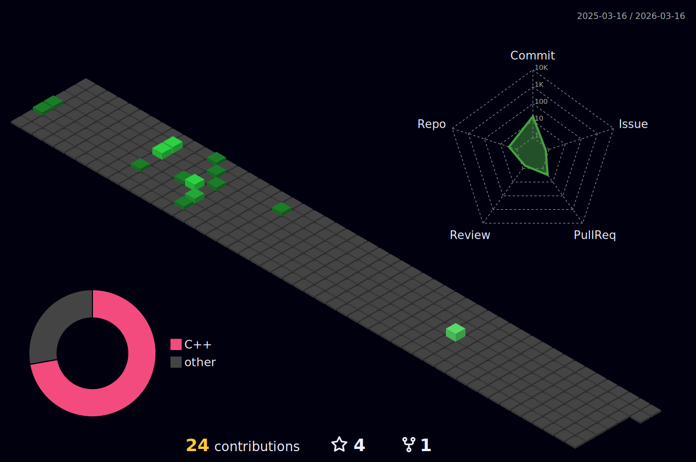

## Hi there 👋 , i'm Paulo!

Student of Computer Engineering at the Federal Institute of Science and Technology of Ceará (IFCE), Technician in Computer Networks graduated on IFCE, focused on Software Development, and related fields.

- 💬 Ask me about Mathematics, Competitive Programming and Algorithms.

## My Github Stats:

## Technologies i'm familiar with:

## Socials:
 
 
  
   
   
   
   
